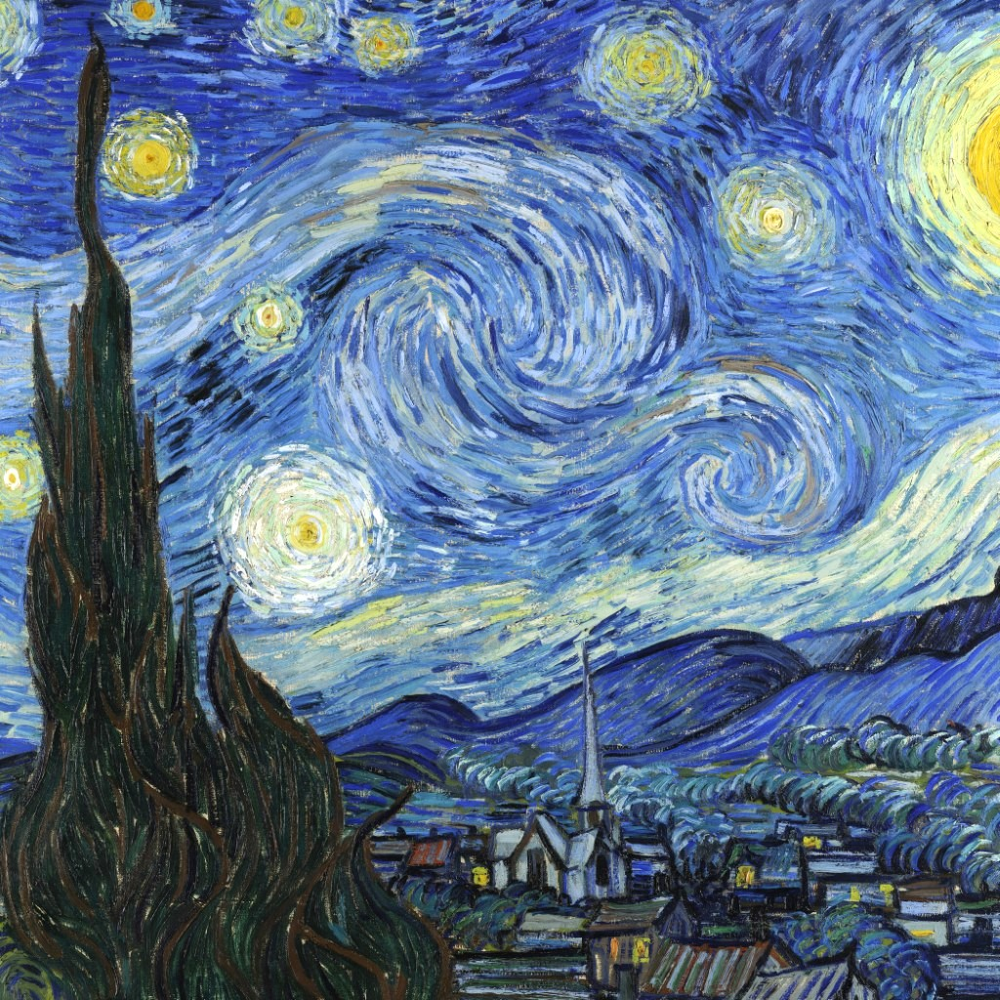
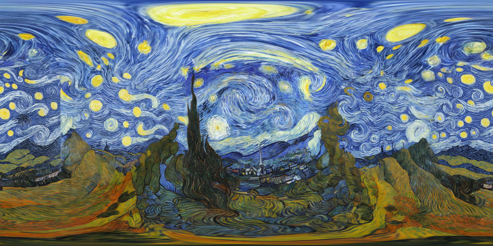
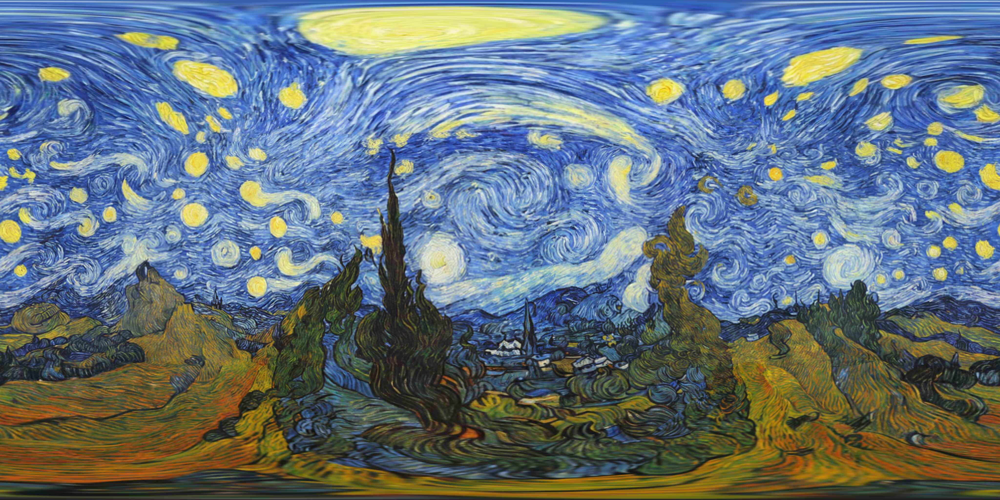

# A-Recipe-Pano-Gen

> ⚠️ **Note**: This codebase was written with the assistance of **Codex**.

Unofficial implementation of the panorama-generation part of:

**A Recipe for Generating 3D Worlds From a Single Image**

- Paper: [arXiv:2503.16611](https://arxiv.org/abs/2503.16611)
- Project page: [katjaschwarz.github.io/worlds](https://katjaschwarz.github.io/worlds/)

This repo currently implements a partial reproduction of Section 3.1, panorama generation.

### Example Outputs

| Input                             | Inpainting                             | Refine                                |
|-----------------------------------|----------------------------------------|---------------------------------------|
|  |  |  |

## File And Directory Overview

```text
.                   
├── pipeline.py                     # CLI orchestration
├── pipeline_helper.py              # Geometry, scheduling, model backends, prompts, debug writing
├── pipeline.toml                   # Default local runtime config
└── README.md
```

## Requirements

```text
python==3.10.20
numpy==1.26.4
Pillow==9.5.0
opencv-python==4.10.0.84
torch==2.5.1+cu118
diffusers==0.35.1
tomli==2.4.1
openai==1.97.1
```

## Inference

```bash
python pipeline.py [--config pipeline.toml]
```

## Configs

| Section      | Key                      | Description                                                      |
|--------------|--------------------------|------------------------------------------------------------------|
| `paths`      | `input`                  | Input perspective image path.                                    |
| `paths`      | `output_root`            | Folder where timestamped output runs are written.                |
| `panorama`   | `width`                  | Output equirectangular panorama width. Must be 2x `height`.      |
| `panorama`   | `height`                 | Output equirectangular panorama height.                          |
| `panorama`   | `input_fov_x`            | Horizontal field of view, in degrees, for the input image.       |
| `view`       | `size`                   | Square perspective view size used for generation and refinement. |
| `view`       | `middle_fov`             | Field of view for horizontal panorama views.                     |
| `view`       | `vertical_fov`           | Field of view for top and bottom views.                          |
| `models`     | `inpaint_model_id`       | Diffusers inpainting model id.                                   |
| `models`     | `refine_model_id`        | Diffusers image-to-image refinement model id.                    |
| `vlm`        | `base_url`               | OpenAI-compatible VLM endpoint.                                  |
| `vlm`        | `model`                  | VLM model name.                                                  |
| `vlm`        | `api_key`                | API key for the VLM endpoint.                                    |
| `prompting`  | `mode`                   | `directional`, `coarse`, or `caption`.                           |
| `synthesis`  | `seed`                   | Seed for inpainting generation.                                  |
| `synthesis`  | `num_steps`              | Inpainting inference step count.                                 |
| `synthesis`  | `guidance_scale`         | Inpainting classifier-free guidance scale.                       |
| `synthesis`  | `mask_dilate_kernel`     | Kernel size for inpaint mask dilation.                           |
| `synthesis`  | `mask_dilate_iterations` | Number of mask dilation iterations.                              |
| `synthesis`  | `overlap_blend`          | Blend generated overlap regions when stitching views.            |
| `refinement` | `enabled`                | Enable or skip final img2img panorama refinement.                |
| `refinement` | `steps`                  | Refinement inference step count.                                 |
| `refinement` | `guidance_scale`         | Refinement classifier-free guidance scale.                       |
| `refinement` | `denoise_strength`       | Img2img denoise strength for refinement.                         |

Optional `vlm` keys:

- `http_referer`: sent as `HTTP-Referer` when non-empty.
- `title`: sent as `X-OpenRouter-Title` when non-empty.

Prompt modes:

- `directional`: uses separate global, sky/ceiling, ground/floor, and negative prompts from the VLM.
- `coarse`: uses the VLM global prompt for all panorama directions.
- `caption`: asks the VLM for one caption and uses it as the generation prompt.

## Citation

```bibtex
@inproceedings{schwarz2025recipe,
  title={A recipe for generating 3d worlds from a single image},
  author={Schwarz, Katja and Rozumny, Denis and Bul{\`o}, Samuel Rota and Porzi, Lorenzo and Kontschieder, Peter},
  booktitle={Proceedings of the IEEE/CVF International Conference on Computer Vision},
  pages={3520--3530},
  year={2025}
}
```
